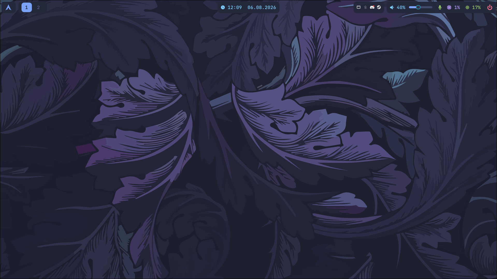
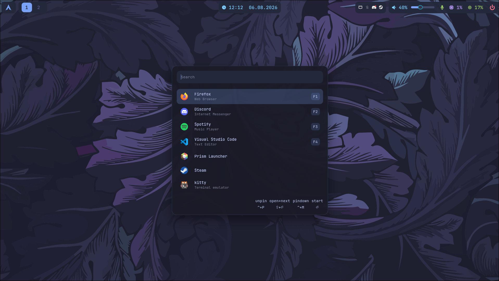
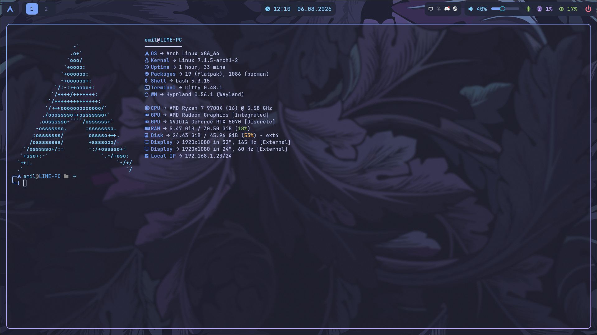
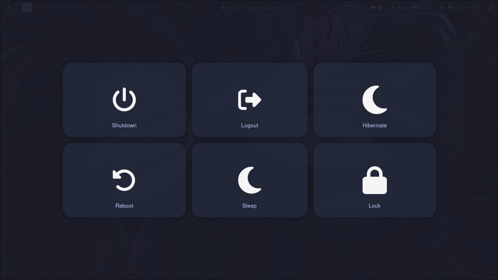

# Arch Linux Hyprland Dotfiles

Minimal, fast and carefully configured **Arch Linux + Hyprland** desktop environment featuring a **Tokyo Night** color scheme.

---

## Preview

<!-- Replace these paths with your own screenshots -->

### Desktop

### Application Launcher

### Terminal

### Wlogout

---

## About

This repository contains my personal dotfiles for an Arch Linux desktop running the Hyprland Wayland compositor.

The configuration focuses on:

* Minimal and consistent visual design
* Tokyo Night color palette
* Keyboard-driven navigation
* Lightweight applications
* Clean and maintainable configuration files
* Practical defaults for daily development and desktop use

> [!NOTE]
> These dotfiles are built for my personal setup. Review the configuration files before copying them to your system.

---

## Software

Update this table to match the applications used by your setup.

| Component            | Software                                                                           |
| :------------------- | :--------------------------------------------------------------------------------- |
| Distribution         | [Arch Linux](https://archlinux.org/)                                               |
| WM                   | [Hyprland](https://hyprland.org/)                                                  |
| Status bar           | [Waybar](https://github.com/Alexays/Waybar/)                                       |
| Application launcher | [Walker](https://github.com/abenz1267/walker/)                                     |
| Terminal             | [Kitty](https://sw.kovidgoyal.net/kitty/)                                          |
| Shell                | [Bash](https://www.gnu.org/software/bash//)                                        |
| Bash RC              |                                                                                    |
| Notifications        | [Dunst](https://github.com/dunst-project/dunst)                                    |
| File manager         | [Nautilus](https://docs.xfce.org/xfce/thunar/start)                                |
| Text editor          | [Neovim](https://neovim.io/)                                                       |
| Wallpaper Manager    | [awww](https://codeberg.org/LGFae/awww)                                            |
| Wallpaper            | [Wallpaper](https://wallhaven.cc/w/d6j79o)                                         |
| Screen locking       | [Hyprlock](https://wiki.hyprland.org/Hypr-Ecosystem/hyprlock/)                     |
| Screenshot utility   | [Grim](https://sr.ht/~emersion/grim/) + [Slurp](https://github.com/emersion/slurp) |
| Color scheme         | [Tokyo Night](https://github.com/folke/tokyonight.nvim)                            |

---

### Directory Overview

| Path              | Description                                      |
| :---------------- | :----------------------------------------------- |
| `screenshots/`    | Screenshots displayed in this README             |
| `.config/dunst/`  | Dunst notification daemon configuration          |
| `.config/hypr/`   | Hyprland, Hyprlock and Hypridle configuration    |
| `.config/kitty/`  | Kitty terminal configuration                     |
| `.config/nvim/`   | Neovim configuration                             |
| `.config/walker/` | Walker application launcher configuration        |
| `.config/waybar/` | Waybar modules, layout and styling               |
| `.config/awww/`   | Wallpaper daemon configuration                   |
| `.bashrc`         | Bash shell configuration and interactive aliases |

---

## Credits

This configuration is inspired by the Arch Linux, Hyprland and Linux customization communities.

Special thanks to the maintainers and contributors of the software used in this setup.

---

## License

This repository is licensed under the [MIT License](LICENSE).

You may use, modify and redistribute the configuration files. Attribution is appreciated but not required.

---

Made with Arch Linux, Hyprland and an unreasonable amount of configuration.

